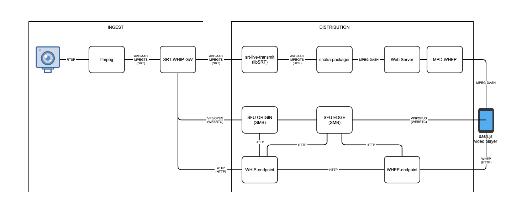

# SRT to MPD-WHEP Reference implementation



## Requirements
- docker
- srt/srt-live-transmit
- Simple web server eg. [serve](https://www.npmjs.com/package/serve)

### Setup

**Start the WHIP-WHEP docker containers**

`curl -SL https://raw.githubusercontent.com/Eyevinn/whip-whep/main/docker-compose.yml | docker-compose -f - up -d`

**Start the SRT-GATEWAY docker container** 

First we need to find out which network WHIP-WHEP is on

```
docker network ls

NETWORK ID     NAME                     DRIVER    SCOPE
d8e65abb5e48   host                     host      local
18bd740cfe25   none                     null      local
02eedf7089a9   whip-whep_default        bridge    local
```

In this case they are running on the docker network called `whip-whep_default`

Start the SRT WHIP Gateway on this network:

```
docker run --network whip-whep_default -p 3000:3000 -p 9000-9999:9000-9999/udp eyevinntechnology/srt-whip
```

The SRT Gateway is now available on `http://localhost:3000`

You will have to use the following WHIP URL when setting up the transmitter: `http://ingest:8200/api/v2/whip/sfu-broadcaster?channelId=test`

`ingest` is the alias used in the docker network for the ingest container

**Setup shaka-packager**

Start srt-live-transmit in listener mode and output udp, this is to be able to pipe it to shaka-packager

`srt-live-transmit srt://4141/?mode=listener udp://:1234`

Start shaka-packager

```sh
packager \
  'in=udp://127.0.0.1:1234,stream=audio,init_segment=dash/shaka_audio.mp4,segment_template=dash/shaka_audio_$Number$.m4s' \
  'in=udp://127.0.0.1:1234,stream=video,init_segment=dash/shaka_video.mp4,segment_template=dash/shaka_video_$Number$.m4s' \
  --mpd_output dash/manifest.mpd
```

serve the dash manifest and segments on `localhost:5000`

`serve dash --cors -l 5000`

**Create the transmitter**

To manage your transmitter you can either use the UI `http://localhost:3000/ui` or the API `http://localhost:3000/api/v1/tx`, we're going to use the [API](http://localhost:3000/api/docs/):

*There is a POSTMAN collection [here](https://github.com/Eyevinn/srt-whip-gateway/blob/main/docs/SRT-GATEWAY.postman_collection.json)*

First create a transmitter

`POST /api/v1/tx/` 

```json
{
    "port": 9995,
    "whipUrl": "http://ingest:8200/api/v2/whip/sfu-broadcaster?channelId=srt", // ingest:8200 referes to the WHIP docker container
    "passThroughUrl": "srt://<local-ip>:4141", // PassThrough to the ffmpeg instance that will produce the MPEG-DASH manifest
    "status": "idle"
}
```

Then start the transmitter

`PUT /api/v1/tx/9995/state`

```json
{
    "desired": "running"
}
```

**Ingest RTSP**

Now we can start ingesting with ffmpeg
  
```sh
ffmpeg -i "rtsp://<username>:<password>@<rtsp-address>" -c:v libx264 -tune zerolatency -preset ultrafast -c:a aac -f mpegts "srt://localhost:9995"
```

You should now have a working WebRTC stream available through WHEP at `http://localhost:8300/whep/channel/srt`

**Egress**

Run the MPD-WHEP Docker container with the MPD & WHEP env variables set to your WHEP and MPD sources.

`docker run -e MPD=http://<local-ip>:5000/live.mpd -e WHEP=http://localhost:8300/whep/channel/srt -p 8000:8000 -d mpd-whep`

You now have a MPD with both normal segments and WebRTC 🙌

`http://localhost:8000/manifest.mpd`
